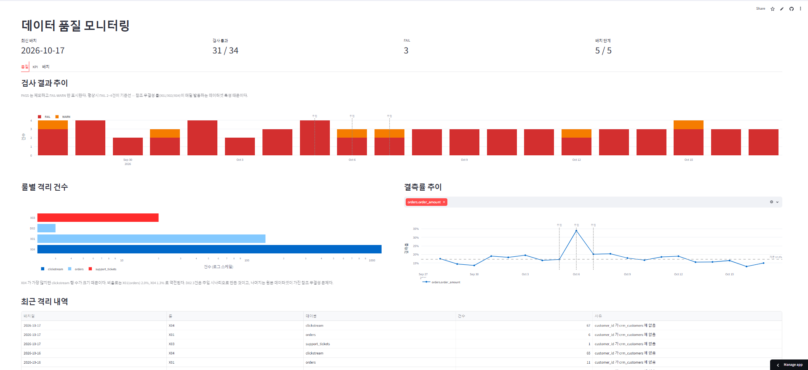
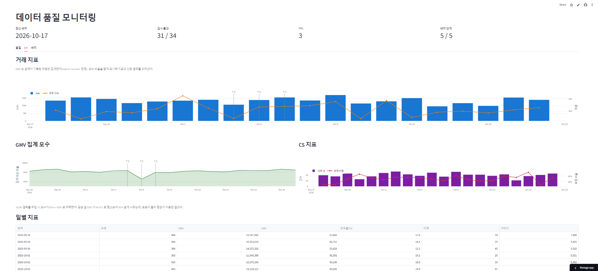
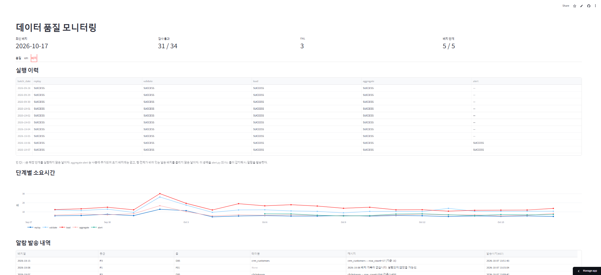
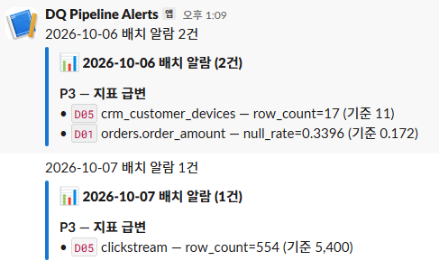
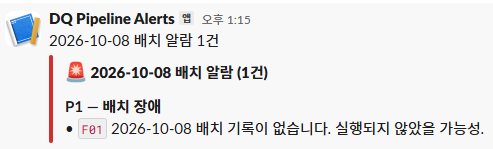
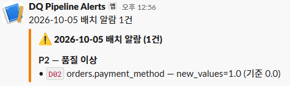

**[대시보드 보기](https://project3-dq-dashboard.streamlit.app/)** · 매일 한국시각 07:00 자동 실행 · [실행 이력](../../actions)
> 무료 호스팅이라 접속이 없으면 절전 상태가 됩니다.
> 보통 5초 내에 열리지만, 오래 접속이 없었다면 30초까지 걸릴 수 있습니다.





# 데이터 품질 모니터링 파이프라인

매일 도착하는 이커머스 데이터를 검증하고, 품질 지표를 시계열로 축적하며,
이상 징후를 즉시 알리는 자동화 파이프라인입니다.

매일 한국시각 07:00 자동 실행 · [실행 이력](../../actions)

---

## 이 프로젝트가 다루는 문제

데이터 정제는 한 번으로 끝나지 않습니다. 상류 시스템은 말없이 바뀌고,
어제까지 깨끗했던 컬럼에 오늘 이상한 값이 들어옵니다.

이 프로젝트는 **정제가 끝난 뒤의 운영**을 다룹니다.

- 매일 도착하는 데이터를 **검증**하고, 불량 행을 **격리**합니다
- 품질 지표를 **시계열로 축적**해 "언제부터 나빠졌는지"를 추적합니다
- 평상시와 다른 패턴을 **즉시 알립니다**
- 의도적으로 오염을 **주입해** 감시 체계가 실제로 작동하는지 검증합니다

---

## 아키텍처

Parquet (원본, GitHub Release)
│
├─ replay.py 논리 날짜 계산 → 하루치 추출 + 시나리오 주입
├─ validate.py 검증 룰 실행 → 격리 + mart.dq_daily 기록
├─ load.py raw 적재 (COPY, batch_date 기준 멱등)
├─ aggregate.py mart.daily_kpi 갱신
└─ alert.py 임계 초과 시 Slack 발송
│
└─ run_batch.py 위 5단계를 순서 실행 + mart.batch_log 기록


| 구성 | 선택 | 비용 |
|---|---|---|
| 스케줄러 | GitHub Actions (cron) | 무료 |
| DB | Neon PostgreSQL 18 (Singapore) | 무료 |
| 대시보드 | Streamlit | 무료 |
| 알람 | Slack Incoming Webhook | 무료 |

### 스키마 구성

| 스키마 | 역할 | 제약조건 |
|---|---|---|
| `raw` | 도착 데이터 적재. `batch_date` 로 파티션 | CHECK 25 / FK 6 — **최후 방어선** |
| `quarantine` | 검증 실패 행 보관 (`jsonb` 로 원본 전체) | **없음** — 불량 행을 받는 것이 목적 |
| `mart` | dq_daily / daily_kpi / batch_log / alert_log | PK 위주 |

---


주입일(10/05~10/07)에 점선이 표시되고, 결측률 차트에서
기준선 17.2% 대비 34%로 치솟는 것이 보입니다.

## 운영 현황

19일 연속 운영 기준입니다.

| 항목 | 값 |
|---|---|
| 적재 행 수 | **202,611행** (raw 전체) |
| 일 평균 적재 | 약 6,000행 |
| 배치 소요시간 | 로컬 40초 / Actions 1분 40초 |
| 품질 검사 | 누적 678건 (일 34건) |
| 격리 누적 | **1,334건** |
| 알람 발송 | 4건 (P1 1 / P2 1 / P3 2) |

10/08은 배치를 실행하지 않았습니다. P1 알람(배치 미실행)을
검증하기 위한 것이며, 대시보드 실행 이력에 공백으로 남아 있습니다.

### 격리 분포

| 룰 | 테이블 | 건수 | 해당 테이블 대비 |
|---|---|---|---|
| X04 | clickstream | 1,169 | 1.2% |
| X01 | orders | 144 | 1.9% |
| X03 | support_tickets | 18 | 2.4% |
| **D02** | **orders** | **3** | **주입 시나리오** |

X04가 절대 건수로는 가장 많지만 clickstream 행 수(95,194)가 크기
때문입니다. **비율로 보면 X03(2.4%) > X01(1.9%) > X04(1.2%) 로
순서가 뒤바뀝니다.** 품질 지표를 절대 건수만으로 판단하면 안 되는
이유이며, 대시보드에서 두 관점을 함께 제공합니다.

D02 3건만 주입으로 만든 것이고, 나머지 1,331건은 원본 데이터셋이
가진 참조 무결성 문제입니다. 정제 단계에서는 보이지 않던 것이
운영 감시에서 매일 계량화됩니다.

### 기준선

| 룰 | 대상 | 평상시 범위 |
|---|---|---|
| X01 | orders.customer_id | 4~11건 (1.0~2.4%) |
| X03 | support_tickets.customer_id | 0~3건 |
| X04 | clickstream.customer_id | 57~79건 (1.0~1.4%) |
| D01 | orders.order_amount | 13~20% (기준 17.2%) |
| D05 | clickstream | 5,300~5,600행 |
| D02 | 전 범주형 컬럼 | **0건** |

19일간 이 범위를 벗어난 것은 주입 시나리오 3건과 초기 기준선 설정
오류로 인한 오탐 4건이 전부입니다. 오탐은 원인을 찾아 임계값을
수정했습니다 (D08에 절대 건수 조건 추가, 마스터 테이블 D05 제외).

---

## 설계 판단

### 1. 검증과 DB 제약의 이중 구조

| | DB 제약 (CHECK/FK) | 검증 룰 (validate.py) |
|---|---|---|
| 시점 | 적재하는 **순간** | 적재하기 **직전** |
| 실패 시 | 배치 전체 중단 | 불량 행만 격리, 나머지 적재 |
| 알려주는 것 | "뭔가 잘못됐다" | "무엇이 몇 건, 평소 대비 몇 배" |

불량 행 하나 때문에 그날 데이터 전체가 안 들어가면 안 됩니다.
검증 룰이 먼저 걸러 격리하고, DB 제약은 룰이 놓친 것을 마지막에 막습니다.

실제로 이 구조가 **파이프라인 로직 버그를 두 번 잡았습니다.**
undated 풀의 소비 구간이 겹쳐 중복이 발생했을 때 PK 제약이 걸렀고,
삭제 범위가 의도보다 넓어 참조 무결성이 깨졌을 때 FK가 막았습니다.

### 2. 지표와 함께 모수를 기록한다

`orders.order_amount` 의 17%가 결측이므로 GMV는 전체 주문의 합이 아닙니다.
`mart.daily_kpi` 에 `order_null_rate` 를 함께 저장해
**"GMV 1,327만원 (전체의 82% 기준)"** 으로 표시합니다.

결측률 주입 시나리오에서 이 설계가 작동했습니다. 모수가 82% → 65%로
떨어지자 AOV가 평소보다 30% 높게 나왔는데, 표본이 줄어 평균이 이동한
것이지 실제 구매액이 오른 게 아닙니다. 모수 없이 AOV만 봤다면
오판했을 것입니다.


"GMV 집계 모수" 차트에서 10/06에 65%로 하락하는 구간이
결측률 주입 시나리오의 결과입니다.

### 3. 매일 울리는 알람은 알람이 아니다

참조 무결성 룰(X01/X03/X04)은 이 데이터셋의 상수에 가깝습니다.
원본에 "가입 전 주문"이 1~2% 섞여 있어 매일 발동합니다.

단순 FAIL로 알리면 매일 울리는 소음이 되어 진짜 이상을 가립니다.
**기준선의 3~5배를 넘을 때만** 알립니다. 알람을 끄는 게 아니라
"평소보다 심한 경우"를 거르는 설계입니다.

### 4. 소규모 테이블은 비율 기준이 불안정하다

`support_tickets` 는 일 40건 규모라 1~2건 차이로 격리율이 2.5%p
움직입니다. 운영 초기 7일 중 3일에서 D08(격리율)이 발동했으나
실제 이상은 아니었습니다.

비율(3%)과 **절대 건수(10건)를 모두 초과할 때만** FAIL로 판정하도록
바꿔 오탐을 제거했습니다. 대량 유입 같은 실제 이상은 두 조건을
모두 넘으므로 여전히 감지됩니다.

### 5. 알람 발송 실패가 배치를 중단시키지 않는다

데이터는 이미 적재됐는데 Slack 일시 장애로 배치 전체를 FAILED로
표시하면, 다음 날 P1 알람이 오탐으로 울립니다.

`alert` 단계만 `NON_FATAL` 로 분류했습니다. 실제로 alert.py에
문법 오류가 있던 상태에서 배치가 끝까지 완주하는 것을 확인했습니다.

---

## 검증 룰

전체 카탈로그는 [docs/03_rules_catalog.md](docs/03_rules_catalog.md) 참조.

| 구분 | 룰 | 처리 |
|---|---|---|
| **계약** | C03 PK 중복, C05 적재 0건 | 격리 / 경고 |
| **참조 무결성** | X01~X06 FK 검증 | 격리 |
| **분포** | D01 결측률, D02 범주 신규값, D05 적재량, D08 격리율 | 경고 / 격리 |

### D02를 격리 룰로 둔 이유

처음에는 경고로만 두었습니다. 그런데 주입 시나리오에서
`payment_method = 'bitcoin'` 3건이 들어오자 `ck_orders_payment`
CHECK 제약에 걸려 **배치 전체가 실패**했습니다.

격리로 승격하니 3건만 빠지고 나머지 367행이 정상 적재됐습니다.
경고와 격리의 차이가 파이프라인 생존을 결정한 사례입니다.

---

## 주입 시나리오

상세는 [docs/05_scenarios.md](docs/05_scenarios.md) 참조.

원본 데이터는 그대로 두고, 지정한 날짜에만 오염을 주입해 감시 체계가
작동하는지 확인합니다. 시드를 날짜로 고정해 재현 가능하며,
DB CHECK 제약을 위반하지 않도록 주입합니다
(금액을 비울 때 `amount_flag` 도 함께 채움).

| 날짜 | 주입 | 결과 |
|---|---|---|
| 10/05 | payment_method 3건을 `bitcoin` 으로 | **D02 발동** — 3건 격리, 367행 정상 적재 |
| 10/06 | order_amount 20% 추가 결측 | **D01 발동** — 17.2% → 34.0%, 모수 82%→65% |
| 10/07 | clickstream 적재량 10%로 축소 | **D05 발동** — 5,543 → 554행 |

평상시 날짜에는 해당 룰이 발동하지 않았고, 세 경우 모두 배치는
중단 없이 완주했습니다.

### 시나리오 03에서 드러난 함정

적재량이 90% 줄자 X04 고아행이 77 → 10건으로 **감소**했습니다.
절대 건수만 보면 "품질이 개선됐다"고 오판할 수 있는 상황입니다.
품질 지표는 비율 기준이 함께 필요하다는 근거가 됐습니다.

---

## 알람

| 등급 | 조건 | 억제 |
|---|---|---|
| **P1** | batch_log FAILED / RUNNING 잔류 / 기록 없음 | **없음** |
| **P2** | D02, D08, C03 | 24시간 1회 |
| **P3** | D01, D05, C05 | 24시간 1회 |

P1은 억제하지 않습니다. 품질 경고는 하루 한 번이면 충분하지만
배치 장애는 매번 알려야 하기 때문입니다.

### 검증 결과

| 날짜 | 상황 | 발송 |
|---|---|---|
| 10/04 | 평상시 | **없음** — X01/X03/X04가 기준선 이하로 걸러짐 |
| 10/05 | bitcoin 주입 | P2 D02 |
| 10/06 | 결측률 주입 | P3 D01 |
| 10/08 | 배치 미실행 | **P1 F01** |

재실행 시 억제가 작동해 중복 발송되지 않았습니다.


실행 이력 격자의 10/08 공백이 P1 알람(F01)과 연결됩니다

### 알람에 런북을 포함했습니다

### 알람에 런북을 포함했습니다

담당자가 `D01` 만 보고는 무엇을 해야 할지 알 수 없습니다.
`config/alerts.yml` 의 `rule_info` 에 의미·추정 원인·조치를 정의하고
Slack 메시지에 함께 출력합니다.



심각도별로 색상과 이모지가 구분됩니다.

| | |
|---|---|
|  |  |
| P1 — 배치 장애 | P2 — 품질 이상 |
조치 해당 컬럼의 _raw 값 확인 → 상류 스키마 변경 여부 문의


---

## 기술 선택과 트레이드오프

### GitHub Actions를 쓴 이유

| | 장점 | 단점 |
|---|---|---|
| GitHub Actions | 인프라 비용 0, 실행 이력이 공개 URL로 남음 | 예약 지연(수 분~수십 분), 백필·의존성 관리 빈약 |
| Airflow | 업계 표준, DAG 가시성 | 로컬 Docker로도 메모리 4GB+, 2주 일정에 부담 |
| AWS 상시 가동 | 실무와 동일 | 월 3~5만원, 초기 설정 1~2주 |

**일 1회·6,000행 규모에서는 Actions가 적절합니다.** 일 배치가
수백만 행을 넘거나 작업 간 의존관계가 복잡해지면 Airflow로 옮겨야
합니다. 이 한계를 알고 선택한 것입니다.

### 포기한 것

- **Neon dev/main 브랜치 분리** — 무료 플랜에서 비기본 브랜치가 두 차례
  소실돼 단일 환경으로 운영했습니다. 모든 데이터가 Parquet에서 재생성
  가능하고 초기화에 10초가 걸리므로, 이 규모에서 분리의 실익이
  관리 비용보다 작다고 판단했습니다.
- **dbt** — 설정에 2~3일이 들고, dbt test는 통과/실패만 판정해
  "NULL률이 3일째 상승 중"을 알려주지 않습니다. 목표와 맞지 않아
  검증 결과를 직접 `mart.dq_daily` 에 시계열로 적재했습니다.
- **product_catalog 증분 공급** — 원본에 변경 이력이 없어 인공 생성이
  필요하고, 분포 설계까지 포함하면 약 3.5시간이 추가로 들어 2주 일정을
  초과합니다. 설계는 docs/05_scenarios.md 에 기록했습니다.
- **격리 행 재처리** — 참조 대상이 나중에 도착하면 재적재하는 로직.
  실무의 정석이지만 확장 과제로 남겼습니다.

### 보안

- 접속 정보는 `.env` 와 GitHub Secrets 에만 둡니다 (`.env` 는 커밋 이력 없음)
- 대시보드는 **읽기 전용 계정**으로 `mart` / `quarantine` 만 조회합니다.
  `raw` 접근과 쓰기는 권한 수준에서 차단되어 있습니다
- 배치 스크립트는 건수와 상태만 출력합니다.
  퍼블릭 레포의 Actions 로그는 누구나 볼 수 있기 때문입니다

---

## 데이터 출처

- 원본: [Customer 360 (Kaggle)](https://www.kaggle.com/datasets/vinaykandimalla/customer-360)
- 라이선스: CC0 (Public Domain)
- 성격: **합성 데이터.** 데이터 품질 실습 목적으로 의도적인 오염이
  포함되어 배포된 데이터셋이며, **실제 개인정보는 포함되어 있지 않습니다.**
- 원본의 오염 유형: 결측, 형식 불일치, 표기 비정규화, 범위 이탈값, 중복
- 본 프로젝트는 위 데이터를 정제해 PostgreSQL에 적재한 뒤, 운영 중
  품질 저하를 감시하는 파이프라인을 구성했습니다

원본 Parquet(64MB)은 레포에 커밋하지 않고
[Release](../../releases/tag/data-v1)로 분리했습니다.
`data/sample/` 에 테이블별 30행 샘플이 있으며,
`_flag` 가 기록된 행을 의도적으로 포함시켰습니다
(실제 발생률보다 높은 비율).

---

## 재현 방법

```bash
git clone https://github.com/bookii964/project3_alarm.git
cd project3_alarm

python -m venv .venv
source .venv/bin/activate        # Windows: .\.venv\Scripts\Activate.ps1
pip install -r requirements.txt

cp .env.example .env             # 접속 정보 입력
```

```bash
# 스키마 생성
python -B src/run_sql.py main \
    sql/ddl/10_schemas.sql sql/ddl/11_raw_tables.sql \
    sql/ddl/12_quarantine.sql sql/ddl/13_mart.sql sql/ddl/14_alert_log.sql

# 원본 데이터: Release 에서 source.zip 을 내려받아 data/source/ 에 압축 해제

# 초기 적재 (마스터) 후 일별 배치
python -B src/load.py main --init-only --date 2026-09-28
python -B src/run_batch.py main --date 2026-09-28

# 대시보드
streamlit run app/dashboard.py
```

---

## 문서

| 문서 | 내용 |
|---|---|
| [00_table_spec.md](docs/00_table_spec.md) | 테이블 정의서 / ERD |
| [01_architecture.md](docs/01_architecture.md) | 아키텍처 상세 |
| [02_decision_log.md](docs/02_decision_log.md) | **의사결정 기록** — 선택과 버린 대안 |
| [03_rules_catalog.md](docs/03_rules_catalog.md) | 검증 룰 카탈로그 |
| [04_baseline.md](docs/04_baseline.md) | 기준선 수치와 출처 |
| [05_scenarios.md](docs/05_scenarios.md) | 주입 시나리오와 결과 |
| [06_worklog.md](docs/06_worklog.md) | 작업 일지 |
| [07_runbook.md](docs/07_runbook.md) | 알람 대응 절차 |
| [docs/evidence/](docs/evidence/) | 실행 로그와 스크린샷 |

**[02_decision_log.md](docs/02_decision_log.md)** 를 먼저 보시면
이 프로젝트에서 어떤 판단을 했는지 파악하실 수 있습니다.
하루에 여섯 번 실패하고 각각의 원인을 짚어간 기록도 포함되어 있습니다.